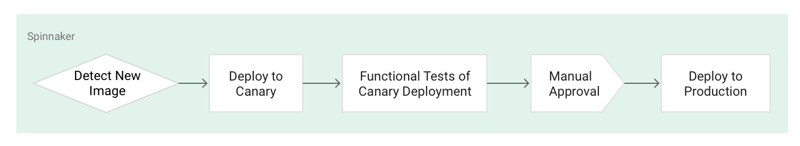
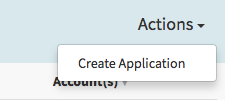
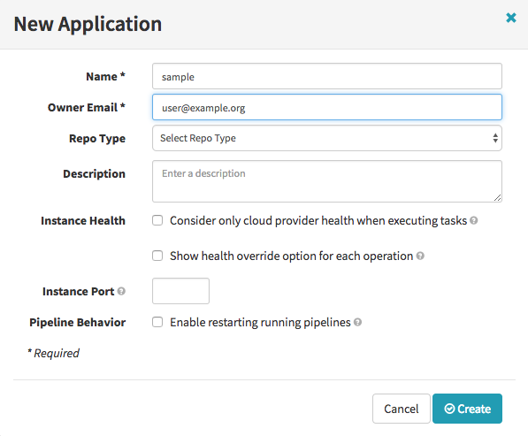
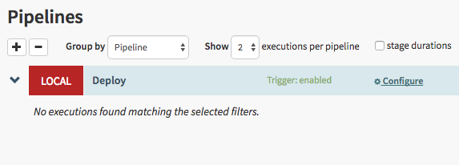

# Creating Your Pipeline

Now that you have your images building automatically, you need to deploy it to the Kubernetes cluster.

You deploy to a scaled down environment for integration testing. Once the integration tests pass, you will need to do a manual approval to deploy the code to go to production services.
 


## Create the application
1. In the Spinnaker UI, click on the “Actions” button, then click “Create Application”
  
1. In the dialog box fill in:
  Name: sample
  Owner Email: <your email address>
1. Then click Create
  


## Create Service Load Balancers
You will now create the load balancers for your services via Kubernetes CLI to avoid having to enter the information manually in the user interface. All of these steps can also be executed through the Spinnaker user interface.

In the Cloud Shell, run the following command from inside the sample-app’s root directory:
```shell
kubectl apply -f k8s/services
```

## Creating the deployment pipeline
You will now create the continuous delivery pipeline from the Spinnaker UI. This pipeline will detect when images are pushed to your repository with a tag prefixed with “v”.

1. In a new tab of the Cloud Shell, run the following command in the source code directory to upload an example pipeline to your Spinnaker instance:

    ```shell
    export PROJECT=$(gcloud info --format='value(config.project)')
    sed s/PROJECT/$PROJECT/g spinnaker/pipeline-deploy.json | curl -d@- -X POST --header "Content-Type: application/json" -- header "Accept: */*" http://localhost:8080/gate/pipelines
    ```

1. In the Spinnaker UI, click the Pipelines button along the top navigation bar
  
1. Click on the “Configure” button in the Deploy pipeline
  
1. You should see the continuous delivery pipeline configuration in the UI:
  


## What's Next

With a pipeline in place, it's time to use it to deploy container images.
