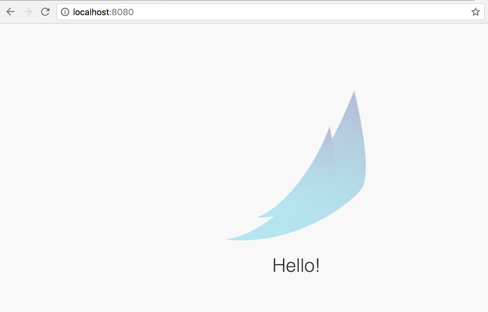
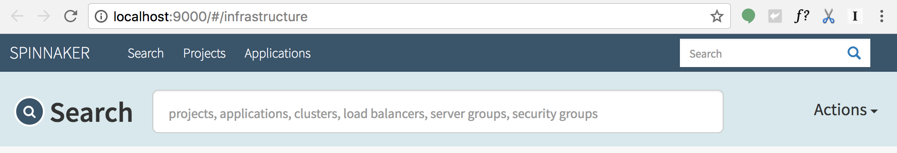

# Installing Spinnnaker
In this lab, you will use Helm to install Spinnaker from the Charts repository. Helm is a package manager that makes it easy to configure and deploy Kubernetes applications.  Once you have Spinnaker installed, you'll be able to set up your CI/CD pipleline.

### Installing Helm
1. Download and install the helm binary
```shell
wget https://storage.googleapis.com/kubernetes-helm/helm-v2.5.0-linux-amd64.tar.gz
```

1. Unzip the file to your local system:
```shell
tar zxfv helm-v2.5.0-linux-amd64.tar.gz
cp linux-amd64/helm .
```

1. Initialize Helm. This ensures that the server side of Helm (Tiller) is properly installed in your cluster.
```shell
./helm init
./helm update
```

1. Ensure Helm is properly installed by running the following command. You should see versions appear for both the server and the client of ```v2.5.0```:
```shell
./helm version
Client: &version.Version{SemVer:"v2.5.0", GitCommit:"012cb0ac1a1b2f888144ef5a67b8dab6c2d45be6", GitTreeState:"clean"}Server: &version.Version{SemVer:"v2.5.0", GitCommit:"012cb0ac1a1b2f888144ef5a67b8dab6c2d45be6", GitTreeState:"clean"}
```
### Configure Spinnaker
1. Create a bucket for spinnaker to store its pipeline configuration:
```shell
export PROJECT=$(gcloud info --format='value(config.project)')
export BUCKET=$PROJECT-spinnaker-config
gsutil mb -c regional -l us-central1 gs://$BUCKET
```
1. Create your configuration file by pasting the following commands into your Cloud Shell:
```
export SA_JSON=`cat spinnaker-sa.json`
cat > spinnaker-config.yaml <<EOF
storageBucket: $BUCKET
gcs:
  enabled: true
  project: $PROJECT
  jsonKey: '$SA_JSON'

# Disable minio the default
minio:
  enabled: false

# Configure your Docker registries here
accounts:
- name: gcr
  address: https://gcr.io
  username: _json_key
  password: '$SA_JSON'
  email: 1234@5678.com
EOF
```

## Deploying the Spinnaker Chart
1. Use the Helm CLI to deploy the chart with your configuration set. 
> **Note:** This command typically takes 5-10 minutes to complete.

```shell
./helm install -n cd stable/spinnaker -f spinnaker-config.yaml --timeout 600 --version 0.3.1
```

1. Once that command completes, run the following command to setup port forwarding to the Spinnaker U from the Cloud Shell
```shell
export DECK_POD=$(kubectl get pods --namespace default -l "component=deck" -o jsonpath="{.items[0].metadata.name}")
kubectl port-forward --namespace default $DECK_POD 8080:9000 >> /dev/null &
```
To get to the Spinnaker user interface, click on the Web Preview button in cloud shell, then click “Preview on port 8080”


You should now see the following screen:

followed by the Spinnaker UI:


# What's Next
Now that you have Spinnaker installed on your GKE cluster, it's time to create container images to deploy in the pipeline we'll be creating later.
