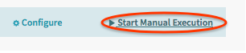
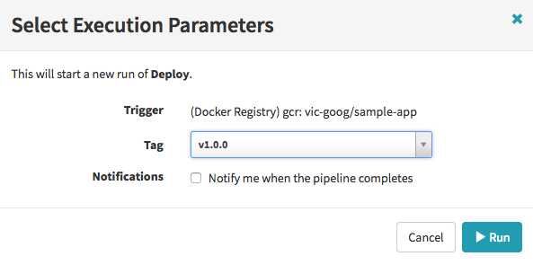
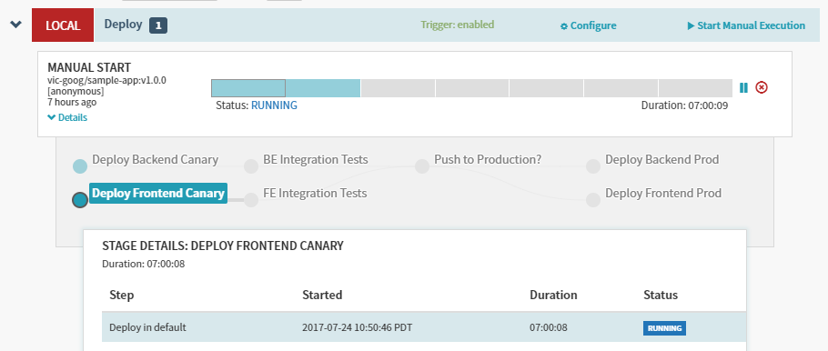
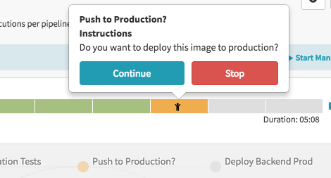
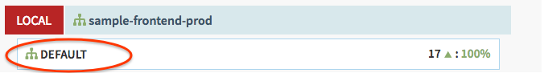
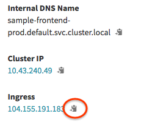
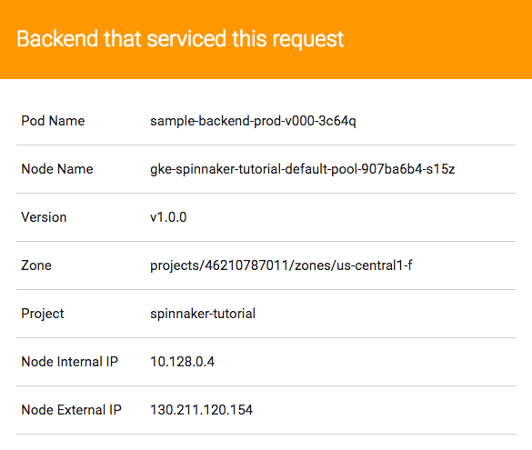
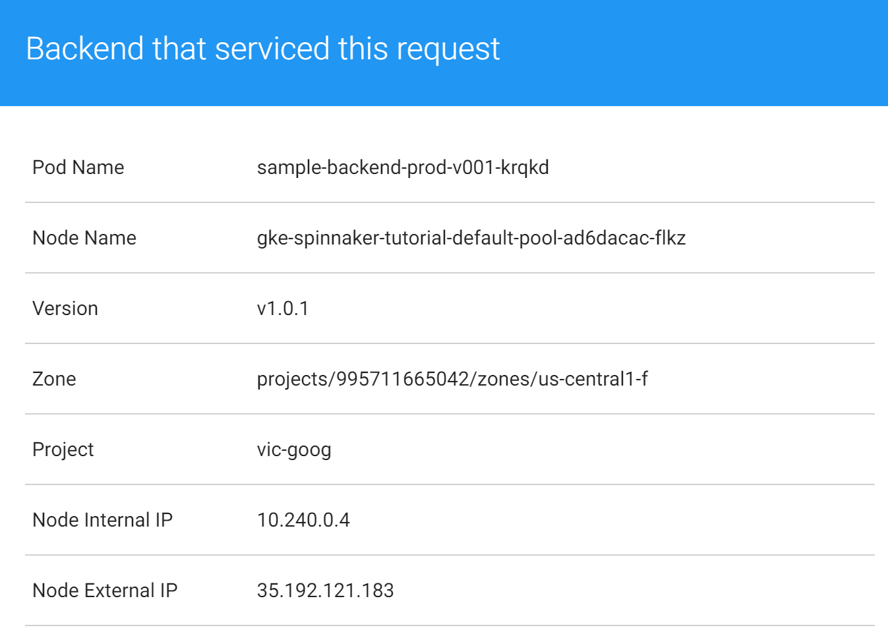

# Triggering Deployments
Deploying container images can happen, manually or automatically.  In this lab, you'll do both: a manual deployment through the Spinnaker UI and an automatic deployment using the Container Builder Build Trigger we set up previously.


## Running your pipeline manually
1. Return to the Pipelines page by clicking on the “Pipelines” button
1. Click on the “Start Manual Execution” button
    
    

1. Select the v1.0.0 tag from the dropdown, then click Run
  
1. Once the pipeline starts, click the “Details” button to see more information about the build’s progress. 
    > **Note:** This section shows the status of the deployment pipeline and its steps. Steps in blue are currently running, green ones have completed successfully and red ones have failed. By clicking on one of the stages, you can see more details about its progress.
  
    
  
1. After about 3-5 minutes the integration test phase will be complete and the pipeline will require a manual approval to continue the deployment. Hover over the Yellow person icon and select “Continue”.
  
1. Your roll out will continue to the production frontend and backend deployments and will complete after a few minutes. 
1. To view the app, first click on “Load Balancers” in the top right of the Spinnaker UI
  
1. Scroll down the list of Load Balancers and click on Default, under “sample-frontend-prod”
  
1. Scroll down the details pane on the right and click the clipboard button  on the Ingress to copy your apps IP address.
  
1. Paste the address into your browser to view the app:
  


## Trigger your pipeline from code changes
Now that your pipeline is running as expected when started manually, you can try triggering it automatically when code changes are pushed. Rather than building after every new commit, you will run it only when new tags are pushed to your Git repository. You have set up your Container Builder trigger to kick off an image build and push it any time a Git tag prefixed with “v” is pushed to your repo. Once the image is successfully pushed, your Spinnaker pipeline will detect that a new image exists in your Container Registry with a “v” prefix and run the pipeline with that image. The same build artifact, your Docker image, will be used across all phases of deployment from unit tests, to canary deployment and finally to your production services.

1. Change the color of the app from orange to blue, then push your change to the source code repository:

    ```shell
    sed -i 's/orange/blue/g' cmd/gke-info/common-service.go
    git commit -a -m "Change color to blue"
    git tag v1.0.1
    git push --tags
    ```

1. After the tag is pushed, you should again see a build in the [Container Builder Build History](https://console.cloud.google.com/gcr/builds). 
1. After the build completes the new image tag will be detected by Spinnaker automatically and it will kick off a pipeline to deploy the image. Return to the Pipelines page by clicking on the “Pipelines” button in the Spinnaker UI
1. After a couple of minutes your pipeline should show in the Pipelines view. Once the pipeline completes your app should look like this:
  

## What's Next

At this point, you've got a working CI/CD pipeline taht can automatically build and deploy application containers when you tag a commit, from your command line!

Some quesitons to consider:
* How do you roll back a change?
* How would you add to or change this setup to work for your production environment?

In the next section, you'll clean up the resources we've allocated.
